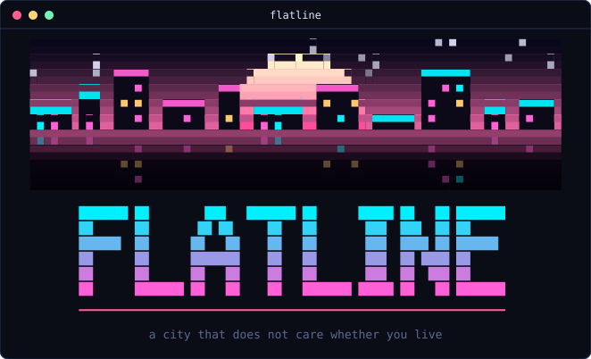
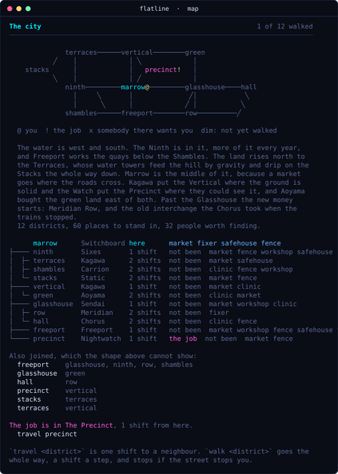
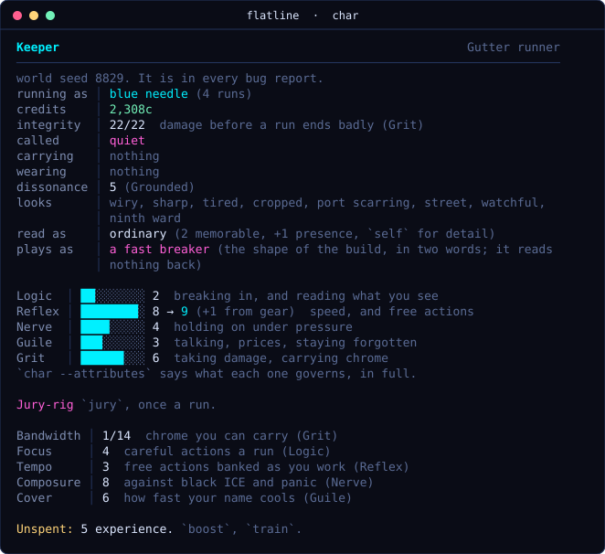
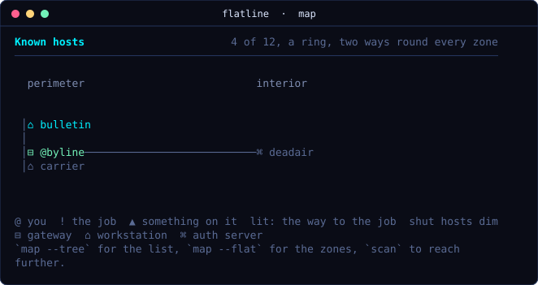
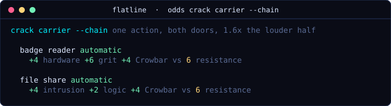
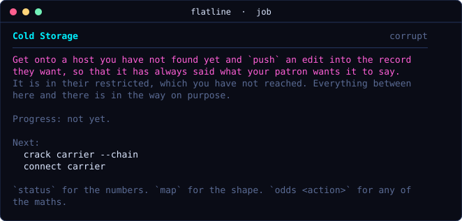
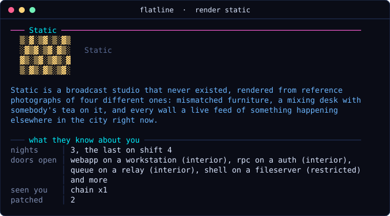
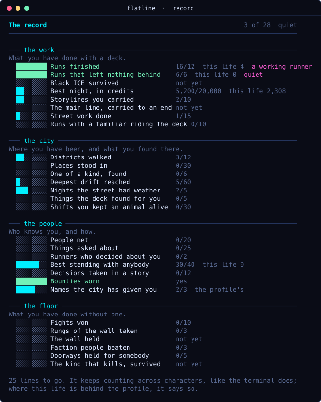

<p align="center"></p>

# flatline

**Version 1.0.** A text-based cyberpunk netrunning game, played by typing at
a fake terminal.

You take contracts from people who want a corporate network interfered with,
break into it while a trace runs against you, and leave before it finishes.
Then the part most games in this genre skip: **the city remembers**. The
evidence you left becomes that faction's attention on you a shift later, the
other runners in this city are taking the work you did not, and the networks
remember you too: the doors you left open are still open next time, until
somebody patches them, and a trail you did not scrub teaches them how you
work.

Python, standard library only. No dependencies, no install, no network access
at runtime.

## What it looks like

Every picture here is the game's own output, captured from a seeded life and
written out as text by `tools/shots.py`; nothing is mocked up.

<p align="center"></p>

<p align="center">


</p>

<p align="center">


</p>

<p align="center">


</p>

<p align="center"></p>

## Getting it

You need **Python 3.11 or newer** and a terminal at least **80 columns** wide
that can show Unicode (`--ascii` if it cannot). Then either:

- download `flatline.pyz` from the
  [latest release](https://github.com/SageSchiller/flatline/releases/latest)
  and run `python3 flatline.pyz`, or
- clone this repository and run `python3 -m flatline` from inside it.

That is the whole install. Nothing is written anywhere but your save directory
(below).

## Running it

```bash
python3 -m flatline              # play (or: python3 flatline.pyz)
python3 -m flatline --seed 8829  # a specific world; seeds reproduce exactly
python3 -m flatline --theme ansi # inherit your terminal's own colours
python3 -m flatline --ascii      # no Unicode
python3 -m flatline --no-color   # no colour at all
python3 -m flatline --no-intro   # skip the cold start
python3 -m flatline --continue   # straight back into the last character
```

It boots. If you are on a colour terminal you get the animated version, and
`title` replays it; everywhere else you get the last frame and the game is
identical. Ctrl-C during it means "get on with it", not "quit". `quit`
powers it down the same way, and Ctrl-C skips that too.

If you have never played a game by typing at it, three things carry you.
**Enter on an empty line** always says what to do next: the one real move,
the reason, and the handful of verbs that matter where you are standing
(`now` is the same thing typed). **`new`** asks three questions, one line
each: which origin, what to call them, and whether to put the opening points
where that origin usually does; `new <handle> --origin <key>` is the same in
one line when you have picked. And **row numbers are names**: wherever the
game shows you a list, `take 2`, `buy 3`, `travel 1` and `switch 2` mean the
row you just read. A typo gets "did you mean", and arriving anywhere ends
with a line of the verbs that district makes possible.

At the prompt, `tutorial` walks you through a first run one instruction at a
time. `help` is one screen: what to read first, the verbs that answer "what
now", and where the rest lives. `help commands` is all 156 verbs, `help
topics` is all 47 explanations, and `help <anything>` finds a verb, a system,
or searches both, including every proper noun in the game.

Two verbs are worth knowing before anything else. **`job`** says what you are
trying to do, where it is, how far along you are, and the next command to
type, in the city and inside a run alike. **`map`** draws wherever you are:
the city, with you and the job marked on it and the walk to anywhere, or
every host you have found and what connects to what. Neither costs any time
and both are always safe to ask. `walk <district>` goes the whole way, a
shift a step, and stops if the street stops you. **`log`** in the city is the
career, one line per run, and the advice reads the same record: a job that
has cut you loose twice is not recommended a third time. `people` is
everybody you have met, where they keep, and how many you have not.

Saves live in `$XDG_DATA_HOME/flatline` (usually `~/.local/share/flatline`),
not beside the code, so moving or reinstalling the game does not touch a
character. That location is correct and is also the one place nobody thinks to
back up, so:

```
save --export ~/backups/keeper.json      # a copy anywhere you like
restore --import ~/backups/keeper.json   # bring it back, here or elsewhere
```

An export is an ordinary save, migrations included: a copy made today still
opens after the format moves on.

## For testers

Thank you. The game has been played to its endings by scripts a few hundred
times; what it has not had is you. Three things are worth an evening each:

1. **The first hour, cold.** Start with `begin` and do what the screen says.
   If at any point you do not know what to type, that is the bug; note what
   was on the screen.
2. **A life.** `new`, pick an origin, and play until something ends: the
   main line (*What Deepwater Is*, which starts when somebody mentions the
   name and stops), a retirement, or a flatline. After the main line there
   is a second arc, *The Ninth Log*, about whichever of the other runners
   the city chooses for you. `journal` is where the stories stand;
   `record` is what is left.
3. **Something you would not normally do.** Keep an animal. Crew a runner.
   Fight for a living in the pit under the Shambles. Owe somebody. Every
   corner has its own threads.

When something is wrong, the most useful report is the **seed** (it is in
`char`), what you typed, and what the game said; `history 20` prints the
last twenty things you typed, and `save --export` makes a file you can
attach. Prose that lands wrong is as much a bug as a crash: the thread key
is beside its name in `journal`.

Known edges: below eighty columns the map and the tables wrap. The author
plays on Python 3.14 on Linux; 3.11 to 3.13 are held by the build's grammar
check rather than tried by hand, and Windows terminals have not been tried
at all. A report from any of those is worth more than most.

## Building a single file

```bash
./build.sh          # produces dist/flatline.pyz
python3 dist/flatline.pyz
```

`zipapp` ships with Python, so the result runs anywhere Python does, with
nothing installed.

## Working on it

```bash
python3 validate.py   # what the content says
python3 test.py       # what the game does
```

Run both after any change. `python3 tools/shots.py` regenerates the pictures
in `docs/` from the game as it is now. They are split on purpose: most of what goes wrong
in a content-heavy game is a dangling reference or a rule quietly broken in one
entry out of two hundred, and that is cheap to catch in `validate.py` and
expensive to catch by playing.

`validate.py` is unusually opinionated. As well as checking that every
reference resolves, it enforces design rules: every implant must have an honest
mechanical drawback, every attribute must govern at least two skills, a
collection on a debt must outpace its interest, no point inside an attribute's
range may be a point you can buy that does nothing, and any content declaring
an ability the engine never reads is a build failure. **That last one is the
recurring bug class in this project**: a passive, an ICE rider or a technique
flag that validates, ships, and does nothing. Its worst form is a rate that is
declared as a float and applied to a value stored as an int, which is not a
slow effect but no effect, and looks identical to a slow one from outside.

## The design

`FLATLINE-PLAN.md` is the long version: a hundred and eighty-one numbered locked decisions,
the systems design, and a session log. **Read it first** before changing
anything structural.

The three ideas everything else hangs off:

- **Noise, trace and residue are three different quantities and are never
  conflated.** Noise is local and decays, trace is the run clock and never
  does, and residue outlives the run entirely. Cleaning up costs time and time
  feeds the trace, so getting out clean and getting out at all pull against
  each other.
- **Failure is a state change, not a game over.** Only black ICE ends a
  character, it only guards cores, and it always telegraphs first. A severed
  connection keeps you out of the chair for two shifts, the city writes down
  which construct did it, and their next network runs that one on your
  route, awake, with your name on it. And a room you keep working in
  at red sends something: six loud ticks and a hunter arrives on your
  host, named, with a tell.
- **The advice knows what it does not know.** `now` is one real move, and it
  reads the same sums the verbs do: it will not name a door you cannot
  open, a job that has already cut you loose, or a walk through somebody
  hunting you. Inside a run, `job` prices the whole night against the
  clock and says when it is over, and with Intrusion 4 it walks through
  doors rather than breaking them.
- **No hidden dice.** `odds` prints the entire sum and the exact percentage
  before you commit, for a crack or a strike, and `odds <any verb>` prints
  what that verb costs tonight; a failed check names the term that sank it. The
  same goes for the weather: about one run in two has a condition tonight,
  announced at the door with its numbers, and one that touches a check is a
  named term in the sum.
- **Being memorable cuts both ways.** What you look like is a build decision
  with 102 options behind it. A face worth describing earns more standing per
  job and turns more of the evidence you left into somebody's heat, and chrome
  puts a floor under it that no haircut gets below.
- **The city is grim on a budget.** Most of what happens around you is
  somebody having a worse day than you in a way nobody records. About one
  event in six comes up for air, because unrelenting bleakness stops landing
  after an hour. The ratio is enforced by `validate.py`, not hoped for.
- **The shell is yours and the city does not get it.** Nine axes of terminal
  customisation, ninety-one pieces, most of them earned by playing. It is
  stored outside the save, so it survives a flatline: you lose everything
  else, and the terminal you spent a week getting right is still there when
  you sit down with somebody new. None of it touches a single number.
- **Everything good is a loan.** Residue becomes heat a shift after you
  thought you got away with it, and the three vices are the same shape said
  three ways: borrow money and it compounds, take something and the comedown
  outlasts and outcosts the high, sit down at a table and the edge is painted
  on the wall before you play. What you are ever buying is when the bill
  arrives, and the trap is never any one of them, it is taking the second to
  pay for the first. A debt you were born with is slower and taken in
  instalments, and working for the people you owe is how it comes down.
- **There is a door, and something goes through it.** `retire` wants nothing
  owed, nothing in you that you need, nobody paying for your name, and enough
  put away: four things the city spends the whole campaign making harder.
  Whichever way you go out, retired or flatlined, you leave exactly one thing
  to whoever you make next, and afterwards the city mentions your name to
  somebody who never met you.
- **A decision is read.** Every choice in every storyline sets a flag, and
  every flag is read by something other than the ending: somebody stops
  being in the city, a counter closes, a favour opens, the streets of one
  faction get safer, a patron stops posting, an ambient event arrives a few
  shifts later happening to somebody else. And every one has a line in the
  ending, whichever ending it is. `validate.py` fails the build on a
  decision nothing reads, because a choice that changes nothing is prose
  with a flag on it.
- **The street and the net want opposite hours.** At peak the walkways are
  full, which is bad for you out there and good for you in here, because all
  those people are generating the traffic you hide in. At night nobody is
  looking at you on the street and your session is the only session in the
  network. There is no correct shift to work, and waiting for the right one
  costs the only thing this city actually charges in.

## What is in it

15 skills with 30 techniques, 6 of them for the street · 33 traits · 12 origins, each with a signature
verb nobody else can use and its own starting face · 14 icons · 58 implants · 13 weapons and 3 things to wear · 70 programs
· 34 deck components · 25 of all of those one of a kind, never sold, found at a place at an hour or handed over by a decision, each with a history · 28 countermeasures · 9 pieces of bench work · 12 factions, each with a mark on the district it holds · 7 rival runners who decide about you, and one you can keep · 32 named characters who keep hours, hand out work, keep private stock and do favours on a tab · 63 storylines across 215 scenes and 208 decisions, every one of them read back by the world and every scene played where it is set, with a spine through the middle that has four endings and one of them is a door ·
102 appearance features · 12 districts, drawn, each with what it is built of, what it works at, its named quarters and what is past its edge, 72 quarters in all, a scene for every hour, 151 things to see in the street, 20 written crossings between them, and 60 places to go and stand · 204 ambient city events, 91 of them consequences of something you decided and 15 of them rumours that stop when the thing is found · 47 manual topics · networks in six shapes · the street in four tiers and 24 ways it stops you, six of them written for one street only ·
14 drugs · 3 lenders · 2 games of chance in 5 rooms · 6 animals to keep and 5 constructs to run with, none of them any help at all · a pit with 5 names on the wall · 8 conditions a network can be under tonight, and 6 the street can · a record of 28 lines in 4 sections and 18 more titles the city gives for a deed, all of them pinnable, and 7 ambitions on the way to it ·
156 commands · 91 pieces of terminal across 9 axes.

Every number on every one of those is read by the engine, and `validate.py`
holds it to that: every modifier key and every rider string in the content
has to appear in the code that is not content, or the build fails. `inspect`
anything before you pay for it.

The street is real. Walk into a district where your name is worth money and
some of them are waiting: a price on a kerb, a photograph in a doorway, a
van, and, at the top of the ladder, people who have stopped asking. You run,
talk, pay, or stand there, each a printed check on two street skills, and the
street can kill you, after it has warned you in so many words. `errands` is
the work that needs no deck.

And the street can be fought, though it never has to be: `fight` is on every
encounter with people in it, beside the answers that are not a fight, and it
is rounds rather than a check: strike, guard, the deck against their chrome,
a finisher, a talk-down, a way out. A fifteenth skill, a fence shelf of
weapons on one axis (quiet or loud, and the law hears loud), armour worn and
fitted, chrome that fights, four styles, what you beat people with taken off
them, a fighter's living in muscle work and a fixer's street jobs, and a
pit under the fence in the Shambles with a wall of names and a blade at the
top you can only get by taking it. Combat is a way to survive the street. It
is never a way to do a job.

`record` is the screen that answers what is left: four sections for four
reasons to play (the work, the city, the people, the floor), counts that
survive the character the way the terminal does, and a name the city starts
calling you rather than a badge.

The deck is not only for runs. In the city it has mail from the people who
would actually message you, a search that knows where every shelf in the
city keeps a thing this cycle, a watch that says when it lands, a line to
the other runners that they answer according to what they think of you, and
the ads, which have read you and would like you to know it.

Footnotes are a real feature of the console. `{{like this}}` in any content
string gets lifted out and printed under the block, and they nest, because the
whole reason to have a footnote is the writer who gets halfway through an aside
and needs an aside about the aside.

## Licence

MIT. See `LICENSE`.
